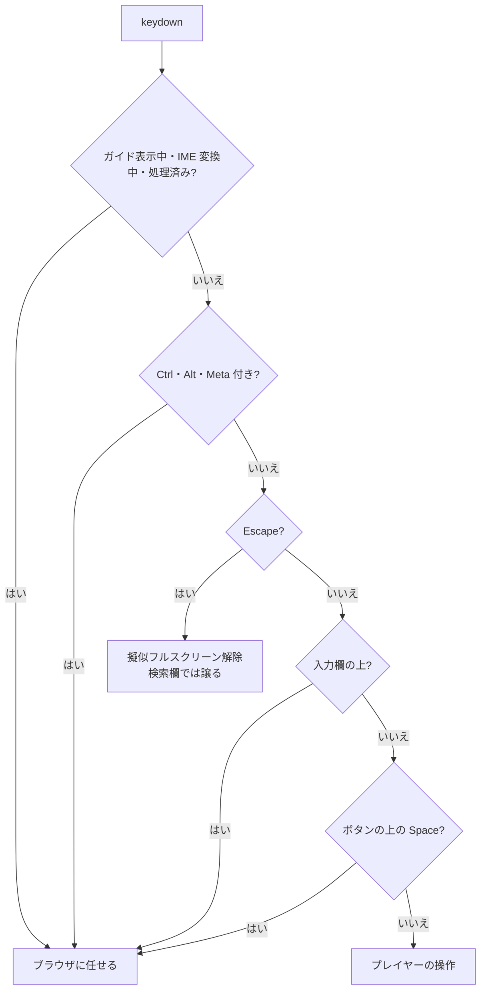

# TODO-118. リンクやボタンにフォーカスが残るとキー操作が効かない

|      | main | 担当 |
|------|------|------|
| 見込み | Opus 5.5 / effort medium | main（実装）+ reviewer（Opus / high）+ verifier（Sonnet / medium） |
| 実施 | Opus 5.5 / effort medium | main（実装）+ reviewer（Opus 5.5 / high、2 回）+ verifier（Sonnet 5.5 / medium） |

| 担当 | モデル | effort | input | output | cache_creation | cache_read | 割合 |
|------|--------|--------|-------|--------|----------------|------------|------|
| main | Opus 5.5 | medium | 70 | 8,842 | 72,058 | 1,765,885 | 72% |
| reviewer | Opus 5.5 | high | 34 | 150 | 42,877 | 488,855 | 21% |
| verifier | Sonnet 5.5 | medium | 14 | 123 | 27,831 | 153,659 | 7% |
| 合計 |  |  | 118 | 9,115 | 142,766 | 2,408,399 | 計 2,560,398 |

- reviewer・verifier は `~/.claude/agents/` の定義のまま（モデルの上書きなし）
- main の分には、着手前にローカルサーバーの URL を答えたやり取りが少し入っている

## きっかけ

`target="_blank"` のリンク（README.md など）を押して元のタブに戻ると、
フォーカスがリンクに残り、どのキーも効かなかった。マウスで再生ボタンなどを
押したあとに ←→ が効かないのも同じ原因。keydown のガード（TODO-076 で
ボタン上の Space が再生操作に化けないように入れたもの）が、`button` と `a` の上で
すべてのキーを止めていた。

## やったこと

`player.html` の keydown ハンドラと操作ガイドを直した。

- `a` を除外の対象から外した
- `button` の上では Space だけをブラウザに任せ、←→・Home/End・F・M は効かせる。
  Enter はプレイヤーが扱わないので、何もしなくてもブラウザへ行く
- 入力欄（`input`・`textarea`・`select`・`contenteditable`）は今までどおり全部任せる
- Ctrl・Alt・Meta 付きのキーは奪わない（reviewer の指摘。ガードを狭めたことで、
  リンクやボタンの上でも Alt+←・Ctrl+F を奪うようになっていた）
- 操作ガイドの「ボタンや選択欄…を操作していないときに使えます」の文を、
  新しい挙動に合わせて書き直した
- `guide.open` の行に残っていた古いコメント「ボタンの Space を再生操作で奪わない。」を消した

## 確かめたこと

verifier が Playwright（chromium、1280x800）で実測した（`archives/agents/TODO-118/verify.py`）。
body・リンク・ボタンの上の →・Space・Home・F・M、select と検索欄の上の →、
Ctrl+→・Alt+→・Shift+F、ガイド表示中の → が、すべて期待どおりだった。
ボタンの上で F を押しても二重には動かず、ボタンの上の Space はそのボタンを 1 回押すだけだった。

実測していないもの（実害は未確認）: `textarea`・`contenteditable`（ページに無い）、
実際の `target="_blank"` のリンク（`index.html` へのリンクで代用）、Meta 付きのキー。

## 残ること

- Ctrl+Escape では擬似フルスクリーンを抜けなくなった。Escape だけで抜けられるので、そのままにした
- Windows の AltGr や Chromebook の Search+← のように、修飾キーが立ったまま届く環境では
  キーが効かないかもしれない。実害は未確認

## 分担の振り返り

- **reviewer** は、操作ガイドの文が古いこと、修飾キーを見ていないために Alt+← などを
  奪う範囲が広がったこと、古いコメントが残っていることを見つけた。
  自分でも Playwright で実測していて、verifier の実測と重なる部分があった
- **verifier** は 8 項目すべてが期待どおりだと確かめた。新しい指摘は無かった
- 見込みと実施は同じだった。reviewer の 2 回目は、修飾キーの return を足したため
- 次に同じ規模の項目をやるなら、reviewer には「実測は verifier がするので、
  静的に読むだけでよい」と書く。重なった実測の分は、reviewer のトークンから減らせた
