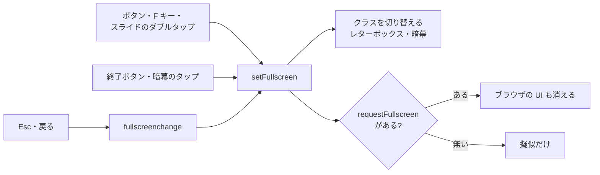
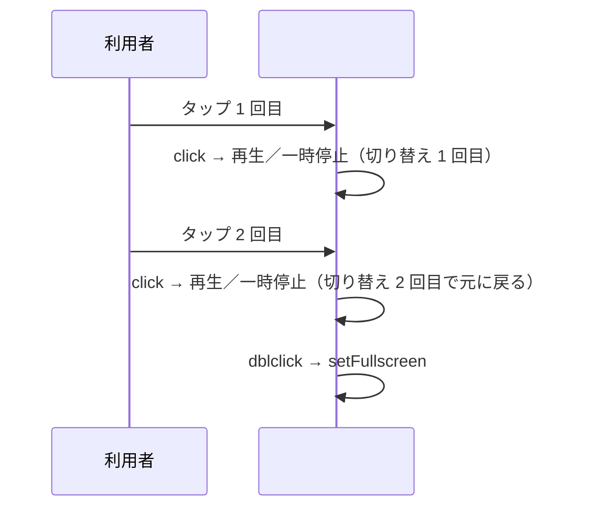

# player.html を直す人へ

**同じ内容をスライドでも見られる**（`player.html?slides=developer`）。

再生エンジン `player.html` を直すときに、先に知っておきたいことをまとめる。
**スライドを足したい・作りたいだけなら [UsersGuide.md](UsersGuide.md) を読む。**
こちらを読む必要はない。

## リポジトリの構成

| ファイル | 役割 |
|----------|------|
| `player.html` | 外枠の HTML・CSS と再生ロジック。本体 |
| `index.html` | スライドの一覧。`ytslide index` が生成する |
| `slides/<名前>.js` | スライドデータ。`readme`・`users-guide`・`developer`・`claude-memo`・`template` |
| `images/` | スライドに貼るビットマップ画像。パスは `player.html` から見た相対 |
| `docs/` | 説明。[UsersGuide.md](UsersGuide.md)（作る人向け）とこのファイル。UsersGuide.md は同梱され、`ytslide init` が作業場所に置く。作業場所には README もこのファイルも無いので、UsersGuide.md からのリンクは GitHub の URL にする |
| `src/ytslide/measure.py` | 読み上げ秒数の測定と `duration` への書き込み（`ytslide measure`） |
| `src/ytslide/index.py` | `slides/*.js` から `index.html` の一覧を作る（`ytslide index`） |
| `src/ytslide/video.py` | スライド一式を MP4 と `.srt` に書き出す（`ytslide video`）。Playwright の `page.clock` で時計を止め、再生中の状態（`isPlaying`・`speechRunId` を進める。読み上げは鳴らさない）にして 1/30 秒ずつ進めて撮る。CSS transition と `element.animate()` は `page.clock` に従わないので、毎コマ `document.getAnimations()` の `currentTime` を合わせる |
| `src/ytslide/pdf.py` | スライド一式を 1スライド 1ページの PDF に書き出す（`ytslide pdf`）。`video.py` の `FIT` を使う |
| `src/ytslide/browser.py` | `check`・`video`・`pdf` が使う chromium の起動と `player.html` の開き方。Playwright か chromium が無ければ入れ方を添えて止める。作業場所を HTTP で配り、作業場所に `player.html` が無ければそれだけ同梱のものを返す（このハンドラーは `web` も使う） |
| `tests/test_measure.py` | `measure.py` の書き込みと置換表の読み込みの自動確認 |
| `tests/test_index.py` | `index.py` の `slidesConfig` の読み取りとマーカー間の差し替えの自動確認 |
| `tests/test_video.py` | `video.py` の分割や字幕の組み立て、`video`・`pdf` コマンドの引数の受け渡し、ffmpeg が落ちたときのエラー文の自動確認。短いスライドを実際に書き出して、コマ送りで決まった時刻に決まった位置まで動いていること（`element.animate()` と、`isPlaying`・`speechRunId` を見る動き）と、クリップの長さが音声＋無音であることも見る（ffmpeg と chromium が要る。無ければ飛ばす） |
| `tests/test_cli.py` | `ytslide init`（`--no-claude` を含む）が置くファイルと、二度目に上書きしないこと、`ytslide web` が作業場所に無い `player.html` を同梱から配ることの自動確認 |
| `tests/test_browser.py` | Playwright か chromium が無いときの案内と、作業場所に `player.html` が無いときの配り方の自動確認 |
| `pyproject.toml` | `ytslide` のパッケージ定義（`uv tool install` で使う） |
| `TODO.md` | 進行中の項目（完了済みの目次は置かない） |
| `archives/` | 決着した TODO 項目と、サブエージェントの報告。**現行仕様ではない** |
| `CLAUDE.md` | Claude Code 向けのプロジェクト規約 |

**プレイヤー側（`player.html` と `slides/*.js`）はビルドも依存関係のインストールも
不要。** インストールが要るのは `duration` の測定・`index.html` の生成・動画の
書き出しを行う `ytslide` の CLI だけ
（[README の「インストール」](../README.md#インストール)）。
テストは `tests/` の 4本（`uv run pytest`）。
Tailwind・Google Fonts・FontAwesome は CDN から読み込む（オフラインでは崩れる）。
このリポジトリは `public_html/` の下にあるので、ファイルを置けばそのまま
公開される。

確認はブラウザで `player.html` を開くだけ。

### 場所を選ばない

`player.html` がローカルを指すのは `slides/<名前>.js` だけで、相対パス。
残りはすべて CDN の https。
**`player.html` と `slides/` を同じディレクトリに置くと、`public_html/` の外でも
動く**。

手元で試すなら、`player.html` をブラウザで開くだけでよい。サーバーを
立てる必要はない。

- **`file://` でも表示と読み上げが動く**（TODO-088 で実測）。相対
  `<script>` の読み込みと CDN の読み込みは通り、Online Voice の
  `translate_tts` も `file://` から 200 で取れて再生できた。コンソール
  エラー・失敗したリクエストは 0件で、`http://` との差は無かった
- **Web Speech API は `file://` でも `http://` でも確かめられていない。**
  実測に使ったヘッドレスの Chromium には音声合成エンジンが無く、
  どちらでも `synthesis-failed` になる。`file://` 固有の制約かどうかは
  切り分けていない
- **ネット接続が必要。** Tailwind・Google Fonts・FontAwesome・読み上げの音声を
  外部から取得するため、オフラインでは崩れ、音声も出ない。
- 公開 URL を変えたくない場合、元の場所にリダイレクトまたはシンボリックリンクを残す。

## 全体の作り

**HTML → `slideData` → 再生ロジック** の 3段。データは別ファイルに分かれている。

`player.html` は `?slides=<名前>` から `slides/<名前>.js` を読み込む
（既定は `readme`）。読み込みは `</main>` 直後の `document.write` で、
**再生ロジックの `<script>` より前に実行する**。その下の `<script>` は
読み込み時点で `slideData` を参照するため、順番を変えると動かない。
スライド一式が読めなかった場合、白画面にせず理由を表示して `throw` で停止する。

`slideData` の各要素は `{ title, duration, narration }` に、
`render()` か `body`（見出しのアイコンは `icon`）が付く。
`render()` があればそれを呼び、無ければ `title` と `icon` から見出しを
作って `body` を枠で包む。
スライド番号は持たず、並び順から計算する。
各キーの意味は [UsersGuide.md](UsersGuide.md) にある。

### 書き間違いの検査（`ytslide check`）

構文エラー・必須キー（`title`・`narration`・`duration`・`body`/`render`）の
欠け・存在しない画像パスの検査は、`player.html` の `window.runSlideCheck`
（末尾の `<script>`）に 1か所だけ置く。`ytslide check`（`src/ytslide/check.py`）
は Playwright で `player.html` を開き、この関数を呼んで結果を読み出すだけで、
検査の基準を持たない。**検査の中身を増やすときはここだけを直す**（`check.py`
側に基準を重複させない）。`duration` と実測の食い違いはここでは見ない
（`ytslide measure` と役割が重なるため）。

## 再生ロジック

`requestAnimationFrame` の `playbackLoop` が経過時間を進め、`duration` が
尽きたら次のスライドへ進む。ただし**実際のスライド送りは読み上げの終了
イベントで起きる**。`duration` を待ち時間として使うのは消音中と音声が
再生できなかったとき（`onerror`・`play()` の拒否）だけ。

### 時間軸に `BASE_SPEED_MULTIPLIER` を掛けない

進行バーと時間表示は**実時間**（`deltaTime * playbackRate`）で進む。
**`BASE_SPEED_MULTIPLIER` は読み上げの速度だけに掛かる**
（`playbackRate * BASE_SPEED_MULTIPLIER`）。時間軸にも掛けると、
バーだけが先行して `duration` で頭打ちになり、読み終わりまで止まって見える。

音声が `duration` より長い場合、バーは 100% のまま読み終わりを待つ。
これは仕様。Web Speech に切り替えると音声の長さが変わるため、
バーとは必然的にずれる。

### `duration` は実測値

`duration` には **Online TTS の音声を `BASE_SPEED_MULTIPLIER` 倍で再生した
実測秒数**を入れる。`slides/claude-memo.js` の 17枚は `ffprobe` で測って
入れた値（合計 324 秒）で、目分量ではない。

**読みの置換表を変えると読み上げの長さも変わる。**
対象スライドの `duration` を測り直す。測定には
`ytslide measure` を使う（`--slides <名前>` でスライド一式を指定、
下書き確認は `--text`）。**`--write` を付けると、測定値を
そのスライド一式の `duration` に書き込む。**
ナレーション編集後は
`ytslide measure --slides <名前> --all --write` でまとめて更新できる。
**`ytslide update --slides <名前>` は、これに続けて `ytslide index` まで走らせる。**

置換表は `player.html` の `SPEECH_RULES` と
スライド一式のファイルから読み込むため、複製ではない。ただし **`TTS_MAX_CHARS` と
`BASE_SPEED_MULTIPLIER` は `player.html` と同じ値**なので、どちらか一方を変えたら
もう一方も変える。片方だけ変えると測定値が実際とずれる。

## 再生の設定を覚える

再生速度・字幕・音声エンジン・待ち秒数は `localStorage` に覚え、
読み込み時に復元する。スライド一式（`?slides=`）ごとには
分けず、全体で 1組の設定を使う。

| 設定 | 変数 | 保存キー | 既定値 |
|------|------|----------|--------|
| 再生速度 | `playbackRate` | `ytSlidePlayer.speed` | `1` |
| 字幕 | `showCaptions` | `ytSlidePlayer.showCaptions` | `false` |
| 音声エンジン | `voiceEngineMode` | `ytSlidePlayer.voiceEngineMode` | `online` |
| 読み上げの声 | `selectedVoiceName` | `ytSlidePlayer.voiceName` | `` （自動） |
| 待ち秒数 | `pauseSeconds` | `ytSlidePlayer.pauseSeconds` | `2` |

読み書きは `loadSetting()` / `saveSetting()` に集約し、`try`/`catch` は
その中だけに書く。`localStorage` が使えない環境（プライベートウィンドウ、
`file://`、サイトデータを止めている環境）でも落とさず既定値で動く。
保存した値も信用せず、`loadSetting()` に渡す `valid` 関数でプルダウンの
選択肢や想定する値かどうかを確かめ、外れていれば既定値に戻す。

字幕・音声エンジンの見た目の反映は `applyCaptions()` / `applyVoiceEngine()`
にまとめてあり、クリックハンドラと起動時（`startApp()` 内、
`renderSlide(startIndexFromHash(), true)` の前）の両方から呼ぶ。同じ見た目の指定を
複製しないため。

## 表示中のスライド番号を URL に載せる

`renderSlide()` の末尾で `history.replaceState(null, '', '#N')` を呼び、
表示が変わるたびに番号（1 始まり）をハッシュへ書く。自動送り・手動送り・
シークバー・チャプター一覧はすべて `renderSlide()` を通るので、書き換える
場所は 1箇所。`replaceState` なので戻るボタンの履歴は増えない。
クエリ（`?slides=`）はそのまま残る。

起動時は `startIndexFromHash()` が `location.hash` を読む。`#` 直後が
数字だけで、枚数の範囲内なら、そのスライドから始める。ハッシュが無い・数値でない・
0 以下・枚数超過は 1枚目に寄せる（URL から来る値は信用しない）。
起動後にアドレスバーでハッシュだけを書き換えたときは、`hashchange` を受けて
同じ規則でスライドを移す。`replaceState` は `hashchange` を起こさないので、
`renderSlide()` の書き換えで繰り返し呼ばれることはない。
アドレスバーでの書き換えは履歴を 1 件増やすので、戻る・進むでも `hashchange` が
起きて表示が移る。

## 読み上げ

2系統をヘッダーのプルダウン `#voice-select` で切り替える。既定は `online`。
消音の `#mute-btn` はそのプルダウンの左に置き、音に関する操作をヘッダーに
まとめてある。アイコンの色はボタン側（`text-lime-400`）に持たせる
（`muteIcon.className` を書き換えるため、アイコンに持たせると消えるため）。

| 選択肢 | モード | 声 |
|--------|--------|-----|
| `Online Voice` | `online` | Google Translate TTS |
| `Web Speech (自動)` | `speech` | 端末の日本語音声から自動で選ぶ |
| 端末の音声の名前 | `speech` | その声（Nanami、Kyoko など） |

端末の音声は `applyVoiceEngine()` が `speechSynthesis.getVoices()` から
`ja` / `JP` の声だけを拾って並べる。**`getVoices()` は空で返ることがある**ため、
`onvoiceschanged` でも `applyVoiceEngine()` を呼び直して並べ直す。
覚えている声がその端末に無ければ `Web Speech (自動)` に戻す。

Chrome の日本語音声は「Google 日本語」で、これは Online Voice と同じ
Google の音声なので、**その端末に他の声が入っていないと切り替えても
声は変わらない**。Nanami・Haruka（Windows）、Kyoko（macOS）、Android の
追加音声は、いずれも OS 側に入っていれば一覧に出る。

| モード | 実装 | 制限 |
|--------|------|------|
| `online` | Google Translate TTS の URL を `Audio` で再生 | `TTS_MAX_CHARS` で分割 |
| `speech` | Web Speech API（`SpeechSynthesisUtterance`） | 長い発話が途中で切れる |

`narration` は `prepareSpeechText()` を通してから読み上げられる。置換表は
**スライド一式の `slidesConfig.rules` が先、`player.html` の `SPEECH_RULES` が後**
の順に適用される。方法は `docs/UsersGuide.md` の「読みを直す」にある。

どちらにも安全タイマーがある。読み終わりのイベントが来ない場合に備える。

- **Web Speech**: 文字数から計算
  （`textToSpeak.length / SPEECH_CHARS_PER_SECOND / getEffectiveSpeed()`）。
  Web Speech は読み終わりのイベントが来ないことがある。
- **Online TTS**: 音声の実長（`loadedmetadata` で取得。失敗時はスライドの
  `duration`）に `TTS_END_MARGIN_MS` を足した時点で進む。

### 再生失敗の通知

Online TTS の `onerror` と `play()` の reject で、`#audio-error-notice`
（`role="status"`）を出し、状態表示を「音声エラー」にする（`showAudioError()`）。
「もう一度再生」は `speakCurrentNarration()`、「音声エンジンを切り替える」は
`#voice-select` の値をもう一方（`online` ⇔ `auto`）に変えて `change` を
発火させる。切り替えのロジックは複製しない。

- **消すのは `stopSpeech()`**。スライド移動・一時停止・消音・エンジン切替・
  再試行はすべてここを通る。再生が始まったとき（`playing`）と読み終わったとき
  （`onended`）にも消す。
- **失敗は `runId === speechRunId` のときだけ扱う。** `stopSpeech()` の後でも
  古い `play()` の reject は届く（`load()` による中断の `AbortError` を含む）。
  弾かないと、次のスライドに前の失敗の通知が出たり、待ちのタイマーを消したりする。
  `AbortError` も通知しない。
- 通知が出ても `setEndTimeout` による自動送りは続く。
- 擬似フルスクリーン中の位置は向きで変える。縦持ちは枠の上（`bottom: 100%`。下は字幕が使う）、
  横持ちと PC は枠の下に余白が無いため、枠の下端に重ねる。字幕の帯とも重なるので、
  `z-index` を字幕より 1 つ上げてある。
- Web Speech の失敗は従来どおり Online TTS へ切り替える。単独の失敗表示は無い。

### 副作用のある実装

次の 3つは実機で音声が出なくなった原因。理由を知らずに「整理」すると再発する。

- **`Audio` 要素（`fallbackAudioElement`）は 1個を使い回す。**
  再生ボタンのクリック内で unlock しているため、`null` にして作り直すと
  Android Chrome で自動再生がブロックされ、音声が出なくなる。
- **Web Speech は `splitForSpeech()` で `maxLen` の既定値分に分けて順に読ませる。**
  Chrome（PC・Android 両方）は長い発話を 15 秒ほどで打ち切る。1つにまとめると
  途中で切れる。
- **`<meta name="referrer" content="no-referrer">` を外さない。**
  Google Translate TTS は Referer 付きの要求に 404 を返すため、外すと
  Online TTS が出なくなる。

## レイアウト

### 拡大縮小は container query

`.video-viewport` が `container-type: inline-size` で、`render()` 内は
`cqw` と `clamp()` で書く。**`px` や `rem` の直書きは 16:9 を縮めたときに
崩れる。**

### 狭い画面とタッチ画面は別系統

**幅 768px 未満とタッチ画面は container query とは別の経路で縮小する。**
条件は `@media screen and (max-width: 767.98px), screen and (pointer: coarse)`。

タッチ画面を条件に加えた理由：横持ちスマホ（844x390 など）が幅 768 以上で
PC 扱いになり、レターボックス内では `clamp()` の下限 px が効いて本文が
縮まず、枠内上部に重なるため。**フルスクリーン中に限らず、タッチ画面なら
通常表示でも別経路に入る**（タブレット・タッチ対応 PC も同じ）。

この経路では、`#viewport-frame` が 16:9 の外枠になり、`setupViewportScale()`
が `--vp-scale` を設定して `#player-viewport`（内容は 960x540 のまま）を
`transform: scale()` で縮小する。

**縮小されるのは枠内のすべてで、`cqw` や `clamp()` で書いていない固定 px の
ものも例外ではない。** 幅 768px 未満では `md:` が効かない
（`md:` は `min-width: 768px`）ため、枠内のクロームは `text-xs` など
小さい方が選ばれ、それがさらに `--vp-scale`（0.34〜0.77）倍される。実際、
枠上の `SLIDE nn / NN` は 390px 幅で約 5px になる。補助情報のため、
**読めなくてよいものとして残している。**

### 字幕バナーだけは枠の外

`#subtitle-banner` は `#viewport-stage` 直下にあり、**縮小されない**。
通常表示では枠に重ねず、**画面幅に関わらず枠の下に配置**（全文を表示するため、
重ねるとスライドを隠してしまう）。これはクラスの `mt-3` で十分。

擬似フルスクリーン中だけは、映画の字幕のように**枠の下端に重ねる**。
16:9 ちょうどの画面では暗幕の帯が 0px で、枠の下に置くと画面の外に出るため。
ただし縦持ちは枠の下に余白があるので、見た目は同じまま枠の下に置く
（重ねると、長いナレーションでスライドの大半が隠れる）。
CSS の `#viewport-stage.is-fullscreen > #subtitle-banner` で、波形と見出し
（`#wave-container`・`#caption-heading`）を隠し、本文だけを半透明の黒い帯に
載せて中央寄せにする。ラッパーがレターボックスそのものなので、`bottom` と
幅の `%` はそのまま枠が基準になる。

- 文字の大きさは枠の幅の 1.8%。枠の幅は `min(100vw, 100dvh * 16/9)` なので
  `min(1.8vw, 3.2dvh)` と書き、`clamp()` で 14〜33px に収める。ラッパーを
  container にして `cqw` で書かないのは、container が `position: fixed` の
  基準になり、暗幕と終了ボタンが画面でなくラッパーに付いてしまうため
- 帯には `pointer-events: none` を付ける。枠のタップ（再生／一時停止）と
  ダブルタップを塞がないため。縦持ちは暗幕の上にあり、素通しにすると
  字幕のタップでフルスクリーンを抜けてしまうので戻す

### 擬似フルスクリーン

レターボックスは `#viewport-stage.is-fullscreen` だけが持ち、**高さの基準は
`100dvh`**（`vh` は dvh 非対応ブラウザ用に残してある）。スマホの
`100vh` は URL バーを含むため、`vh` のままだと横持ちで箱が画面下へ
はみ出す。

内容（`.video-viewport.pseudo-fullscreen`、縮小経路では `#viewport-frame`）
も字幕も、このラッパーを基準に配置。**比率とサイズの変更は
ここ 1か所だけ。**

字幕はフルスクリーン中、枠の下端に重ねる（上の「字幕バナーだけは枠の外」）。

`setFullscreen` はクラスの切り替えに加えて、**ページ全体
（`document.documentElement`）に** `requestFullscreen()` を呼び、ブラウザの
UI も消す。スライドの枠や `#viewport-stage` を対象にしないのは、ブラウザ既定の
`:fullscreen` のスタイルが幅と高さを 100% に固定し、レターボックスが崩れるため。
API が無い環境（iPhone の Safari）では擬似フルスクリーンだけになる。
Esc や戻るジェスチャーでブラウザ側が抜けたときは、`fullscreenchange` を受けて
擬似フルスクリーンも解除する。

フルスクリーン中は、画面の左上隅に終了ボタン（`#fullscreen-exit-btn`）を
常に出す。暗幕の帯は画面比率で 0px になることがあり、Android の
ジェスチャーナビゲーションでは Chrome の案内する［戻る］ボタンも出ないため、
見える出口を置いている。ボタンは `#viewport-stage` の子で、
`.is-fullscreen` のときだけ `position: fixed` で表示する（ラッパーは
transform を持たないので、fixed の基準は画面になる）。右上でなく左上に
置くのは、16:9 ちょうどの画面で枠内の枚数表示と重なるため。

その右隣には字幕の切り替えボタン（`#fullscreen-caption-btn`）を同じ仕組みで
出す。通常画面の「字幕」ボタンは暗幕の裏で押せないため。押すと
`#toggle-caption-btn` の click を呼ぶだけなので、状態（`showCaptions`）と
保存は通常画面と共通。見た目は `applyCaptions()` が両方のボタンに反映する。
`C` キーも同じ click を呼ぶ。

スライドの枠（`#player-viewport`）のダブルタップ・ダブルクリックでも
切り替える。ブラウザは `dblclick` の前に `click` を 2 回送るので、
1 回目のタップで再生／一時停止が切り替わり、2 回目で元に戻る。
`dblclick` のハンドラはフルスクリーンだけを扱う。1 回目を待たせずに
切り替えるのは、反応の遅れを避けるためと、最初のタップで読み上げの
unlock を通すため。再生中にダブルタップすると、一時停止と再開を
通るので、そのスライドのナレーションは頭から読み直しになる。

- 一続きのクリックの中で切り替えた回数（`tapToggles`）を数え、2 回の
  ときだけ `dblclick` に応じる。片方の `click` がスワイプとして捨てられた
  ときは打ち消し合わないため
- 枠には `touch-action: manipulation` を付けている。ダブルタップが
  ズームに取られず、`dblclick` が届くようにするため
- 回数の数え直し（`e.detail` が 1 の `click`）は `document` で受ける。
  暗幕のダブルタップのように 1 回目が枠の外に当たったとき、前の回の
  数が残って入り直さないようにするため。`e.detail` が 0 の `click` では
  数え直さない。枠の `click` から呼ぶ `playBtn.click()` が detail 0 で、
  数え直すと必ず 0 に戻ってしまう

iPhone 向けには `apple-mobile-web-app-capable` などの meta を置いてある。
ホーム画面に追加したページ（`?slides=` を含む URL）は、ブラウザの UI 無しで開く。

### `body.fs-lock` と暗幕

裏のスクロール禁止（`body.fs-lock`）と暗幕（`::before`）は
**幅 768px 未満または `(pointer: coarse)` のときだけ**掛ける。

マウス PC で裏をスクロール禁止にするとスクロールバーが消え、裏ページ全体が
スクロールバー幅ぶん、`100vw` 基準のレターボックスがその半分だけ横にずれる
（実測で約 3px。比率によっては掛けた方が正しい位置になる）。タッチ画面を
条件に加えた理由：横持ちスマホが幅 768 以上で PC 扱いになり、
暗幕のタップで抜けられなくなるため（終了ボタンは別にある）。

暗幕をタップするとフルスクリーンを終了。ハンドラは `#viewport-stage` の
click で、`e.target` がラッパー自身のときだけ応答する（枠内や字幕の
タップでは閉じない）。

**暗幕の帯の幅は画面比率で決まる。** 16:9 ちょうどの画面では帯が 0px に
なり、タップでの終了口がない。**これは対応しないと決めている**
（キーボードとボタンからは終了できる）。

## 直書きしない値

- **スライド枚数を書かない。** `total-slides` と `playlist-count` は
  `initPlaylist()` が `slideData.length` で埋める。
- **総時間を書かない。** `total-time-display` の初期値は `--:--` で、
  `initPlaylist()` が `duration` の合計で上書きする。

---

個々の変更の経緯（条件式の理由、試した内容）は
`archives/todo/` に 1件 1ファイルで記録されている。
